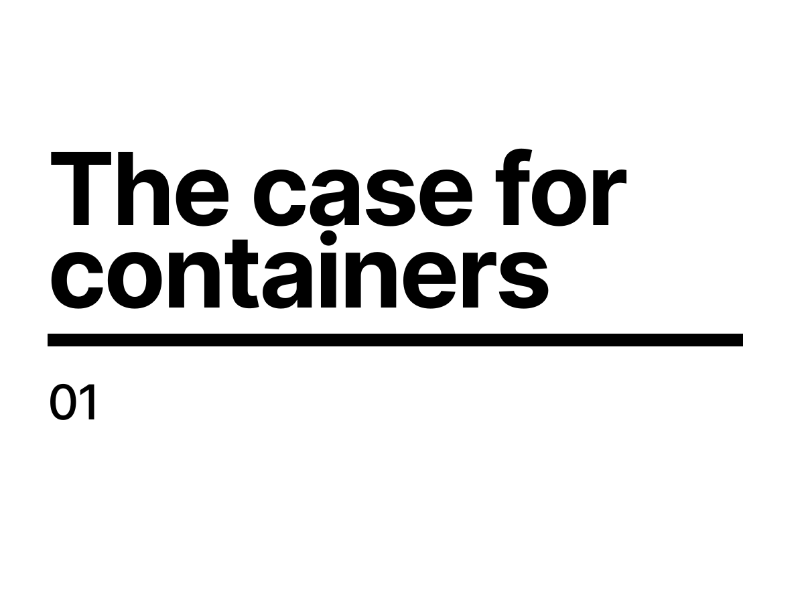
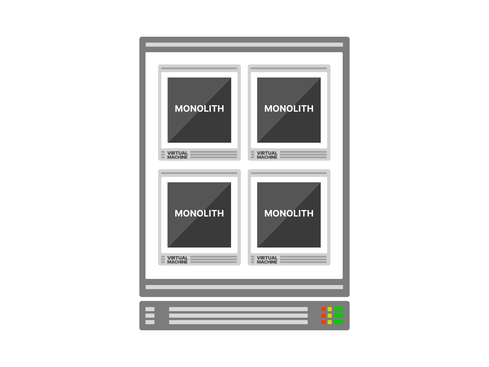
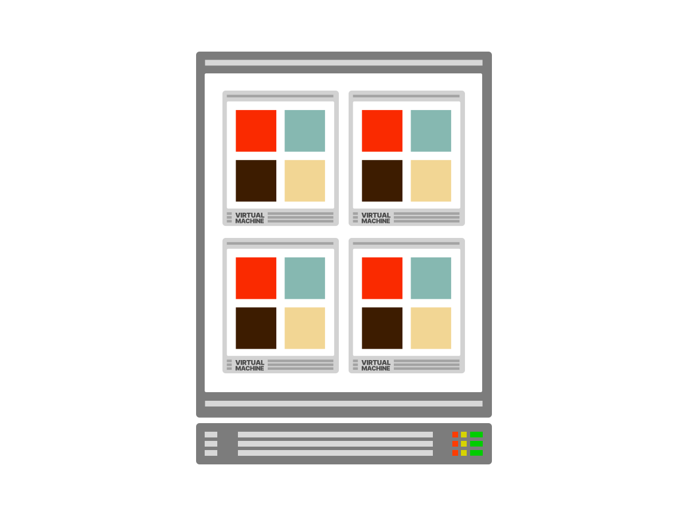

<!--
Before we dive into Kubernetes, let's take the time to explore how the infrastructure has evolved.

#docker-title

-->

---

<!--
1/5
In the past few years. the industry has experienced a shift towards developing ...

#docker-monolith-1

-->

---

<!--
2/5
... smaller and more focused applications.

#docker-monolith-2

-->

---

<!--
3/5
It comes as no surprise that more and more companies are breaking down their apps into a set of decoupled and independent components.

#docker-monolith-3

-->

---

<!--
5/5
As an example you might refactor a single app into 4 components:
- a single sign-on service
- a backend API
- a front-end
- and a worker that consume messages from a queue.

#docker-monolith-4

-->

---

<!--
Apps that are smaller in scope are:
1. Quicker to deploy — because you create and release them in smaller chunks.

#docker-microservice-advantage-1

-->

---

<!--
2. Easier to iterate on — since adding features happens independently.

#docker-microservice-advantage-2

-->

---

<!--
3. Resilient — the overall service can still function despite one of the apps not being available.

#docker-microservice-advantage-3

-->

---

<!--
1/4
Smaller services are excellent from a product and development perspective.
But how does that cultural shift impact the infrastructure?
Developing services out of smaller components introduces a different challenge.

#docker-microservice-parts-1

-->

---

<!--
2/4
Imagine being tasked with migrating a single app into a collection of component...

#docker-microservice-parts-2

-->

---

<!--
3/4
When, for every application, you can refactor the same in a collection of four components, you have three more apps to develop, package and release.

#docker-microservice-parts-3

-->

---

<!--
4/4
If you want to fully isolate the apps, you need 4x the virtual machines you started with.
But virtual machines have trade-offs.

#docker-microservice-parts-4

-->

---